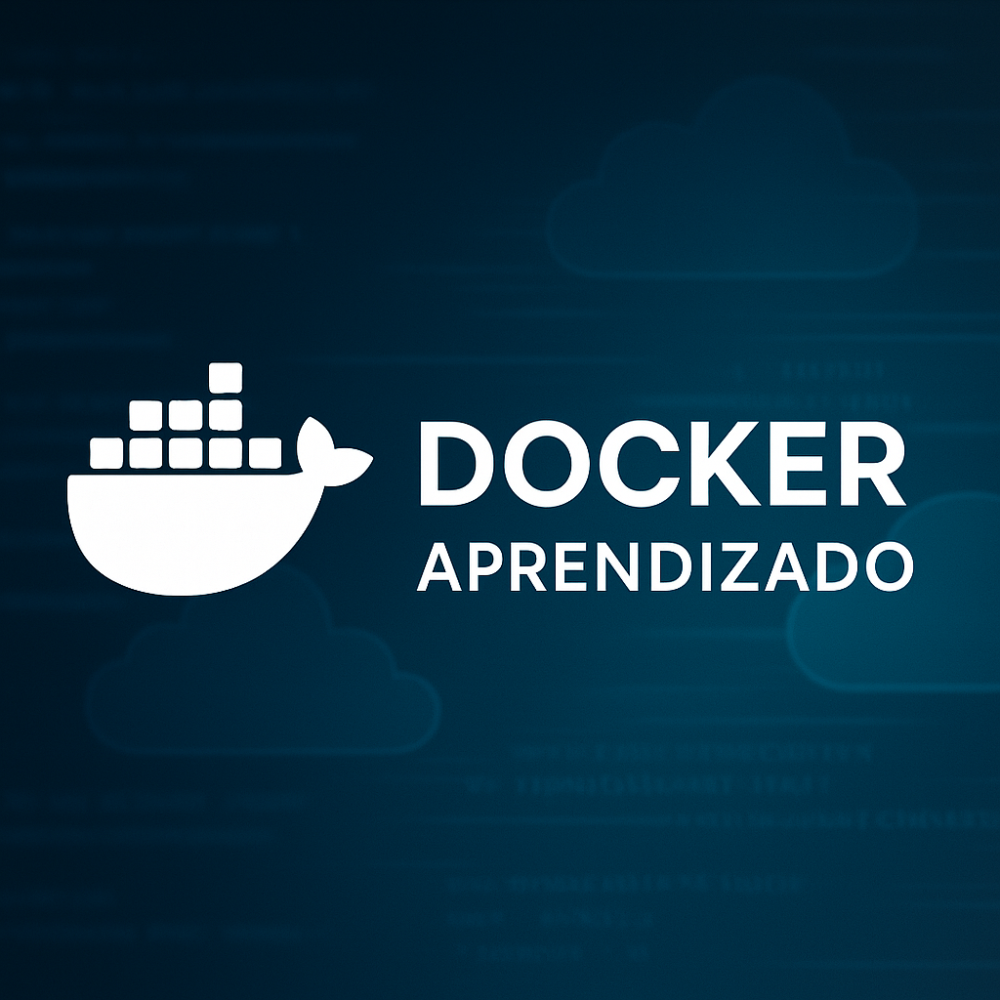

# docker-aprendizado
Repositório com meu aprendizado em Docker: comandos, práticas, certificação DCA.

# 🐳 Docker — Plano de Estudos Prático


<p align="center">
  
</p>

---

## 📚 Sobre este projeto

Este repositório é meu espaço pessoal para registrar estudos, práticas e desafios com **Docker**, desde os comandos básicos até a preparação para ambientes mais complexos e certificações como a DCA.

Você vai encontrar aqui:
- ✅ Checklists de aprendizado por etapa
- 🛠️ Exemplos com Dockerfile e Docker Compose
- 📦 Boas práticas de uso de containers
- 🎓 Roteiro para certificação DCA
- 💥 Casos de uso prático e erros comuns

---

## 🗂 Etapas do Aprendizado

### 📦 Fundamentos do Docker
- [x] Instalar Docker no Linux/Windows
- [x] Rodar `docker run hello-world`
- [ ] Entender imagens, containers, volumes e redes
- [ ] Rodar container interativo `ubuntu` ou `alpine`
- [ ] Usar `docker exec`, `logs`, `ps`, `stop`, `rm`

---

### 🧱 Construção com Dockerfile
- [ ] Criar imagem customizada com `Dockerfile`
- [ ] Usar `COPY`, `CMD`, `ENTRYPOINT`
- [ ] Adicionar variáveis de ambiente
- [ ] Otimizar com múltiplas camadas

---

### 🔧 Composição com Docker Compose
- [ ] Instalar e usar `docker-compose`
- [ ] Criar `docker-compose.yml`
- [ ] Subir app Flask com banco PostgreSQL
- [ ] Criar rede entre containers
- [ ] Mapear volumes

---

### 🛡️ Segurança básica com Docker
- [ ] Usar `--read-only`, `--cap-drop`
- [ ] Limitar recursos (CPU/RAM)
- [ ] Escanear imagens com `docker scan` ou Trivy
- [ ] Isolar redes

---

### 🧪 Prática com Labs Reais
- [ ] Subir o OWASP Juice Shop com Docker
- [ ] Montar ambiente vulnerável com DVWA
- [ ] Criar mini laboratório de testes
- [ ] Rodar containers com logs redirecionados

---

### 🎓 Preparação para Certificação DCA
- [ ] Estudar tópicos da prova (volumes, swarm, logs)
- [ ] Realizar simulados (ex: KodeKloud)
- [ ] Fazer flashcards
- [ ] Criar repositório separado para anotações

---

## 📈 Progresso

```markdown
[>>>>>>>>>>------------------------------] 30% Concluído


📜 Licença
Este projeto é livre para estudos, melhorias e adaptação. 🚀
